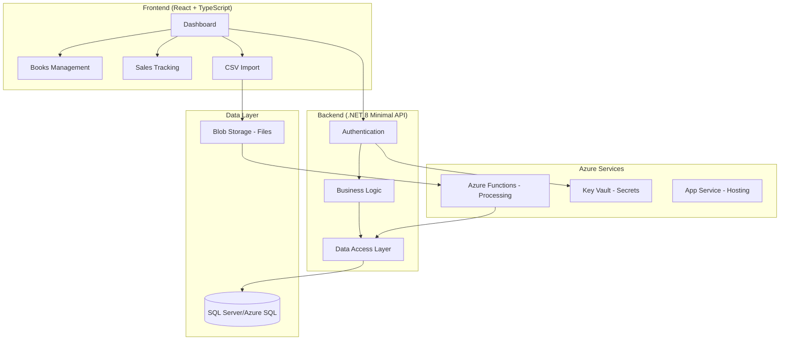

# Dalenii Publishing Tracker - Architecture Plan

## Project Overview
A full-stack web application for independent authors and small publishers to track eBook sales, royalty payments, and advertising spend across multiple platforms (Amazon KDP, IngramSpark, Draft2Digital).

## Architecture Decision Record

### Timeline: 2-4 weeks for job application showcase
### Skill Context: Strong .NET, learning React/TypeScript and Azure

## Phase 1: Local Development Foundation (Week 1)

### Backend API (.NET 8 Minimal API)
```
PublishingTracker.Api/
├── Program.cs                 # Minimal API setup
├── Models/                    # Entity models
├── Data/                      # EF Core DbContext
├── Services/                  # Business logic
├── Controllers/               # API endpoints (if using controllers)
└── appsettings.json          # Local configuration
```

**Key Technologies:**
- .NET 8 Minimal API
- Entity Framework Core (Code First)
- SQL Server LocalDB (development)
- JWT Authentication
- AutoMapper for DTOs

### Frontend (React + TypeScript)
```
publishing-tracker-ui/
├── src/
│   ├── components/           # Reusable UI components
│   ├── pages/               # Main application pages
│   ├── services/            # API communication
│   ├── types/               # TypeScript interfaces
│   ├── hooks/               # Custom React hooks
│   └── utils/               # Helper functions
├── public/
└── package.json
```

**Key Technologies:**
- React 18 with TypeScript
- React Router 6 for routing
- Axios for API calls
- React Query for data fetching
- Chart.js or Recharts for visualizations
- CSS Modules or Styled Components

## Phase 2: Core Functionality (Week 2)

### Database Schema
```sql
-- Core entities
Books (Id, Title, Author, ISBN, PublicationDate, ...)
Platforms (Id, Name, ApiEndpoint, ...)
Sales (Id, BookId, PlatformId, Date, Quantity, Royalty, ...)
Users (Id, Email, PasswordHash, ...)
```

### API Endpoints
```
GET    /api/auth/login
POST   /api/auth/register
GET    /api/dashboard/summary
GET    /api/books
POST   /api/books
GET    /api/sales
POST   /api/sales/import
GET    /api/platforms
```

### Frontend Pages
```
/login          - Authentication
/dashboard      - Main metrics and charts
/books          - Book management
/sales          - Sales data tables
/import         - CSV upload interface
```

## Phase 3: Enhanced Features (Week 3)

### File Processing System
- CSV upload handling
- Background processing simulation (prepare for Azure Functions)
- Data validation and error handling
- Import history tracking

### Advanced UI Features
- Responsive design
- Data filtering and sorting
- Export functionality
- User profile management

## Phase 4: Azure Migration & Deployment (Week 4)

### Azure Services Migration Map

| Local Component | Azure Service | Migration Notes |
|----------------|---------------|-----------------|
| SQL Server LocalDB | Azure SQL Database | EF migrations |
| File System | Azure Blob Storage | Update file handling |
| Background Tasks | Azure Functions | Extract processing logic |
| App Secrets | Azure Key Vault | Environment variables |
| IIS Express | Azure App Service | Web.config setup |

### CI/CD Pipeline (GitHub Actions)
```yaml
# .github/workflows/deploy.yml
name: Deploy to Azure
on:
  push:
    branches: [main]
jobs:
  build-and-deploy:
    - Build React app
    - Build .NET API
    - Run tests
    - Deploy to Azure App Service
```

## Technical Architecture Diagram



## Success Metrics for Portfolio

### Technical Demonstration
- ✅ Modern .NET 8 patterns (Minimal APIs, dependency injection)
- ✅ React functional components with hooks
- ✅ TypeScript for type safety
- ✅ Entity Framework Core code-first approach
- ✅ RESTful API design
- ✅ Authentication and security
- ✅ File upload and processing
- ✅ Data visualization
- ✅ Responsive UI design

### Azure Cloud Integration
- ✅ Azure SQL Database
- ✅ Azure App Service deployment
- ✅ Azure Blob Storage
- ✅ Azure Functions (serverless)
- ✅ Azure Key Vault security
- ✅ Managed Identity authentication

### DevOps & Best Practices
- ✅ Git version control
- ✅ CI/CD pipeline
- ✅ Environment configuration
- ✅ Database migrations
- ✅ Error handling and logging
- ✅ API documentation
- ✅ Professional README

## Risk Mitigation

### Learning Curve Risks
- **React/TypeScript**: Start with simple components, use Create React App
- **Azure Services**: Begin with basic App Service, add complexity incrementally
- **CSS/Styling**: Use a component library (Material-UI or Ant Design) for quick results

### Timeline Risks
- **MVP First**: Focus on core functionality before advanced features
- **Parallel Development**: Work on frontend and backend simultaneously after initial API setup
- **Azure Last**: Ensure local version works perfectly before cloud migration

## Portfolio Presentation Strategy

### GitHub Repository Structure
```
README.md                 # Professional project overview
ARCHITECTURE.md          # This technical architecture
docs/                    # Additional documentation
src/api/                # Backend code
src/ui/                 # Frontend code
azure/                  # Deployment scripts and ARM templates
.github/workflows/      # CI/CD configuration
```

### Live Demo Points
1. User registration and authentication
2. Dashboard with sales metrics and charts
3. Book management CRUD operations
4. CSV file upload and data processing
5. Responsive design demonstration
6. Azure deployment and cloud integration

This architecture balances complexity with achievability, showcasing modern full-stack skills while respecting the timeline and learning curve constraints.