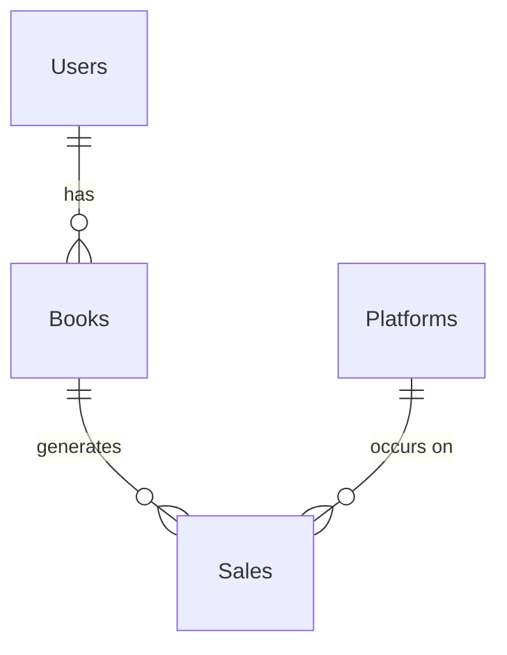

# Database to Entity Mapping

## 1. Database Schema Overview

The local database for the Publishing Tracker application is designed to be a relational database that stores information about users, books, sales platforms, and sales records. The schema is normalized to reduce data redundancy and improve data integrity.

### Key Tables:

-   **`Users`**: Stores user account information.
-   **`Books`**: Stores information about each book belonging to a user.
-   **`Platforms`**: A lookup table for sales platforms.
-   **`Sales`**: Stores individual sales records, linking books and platforms.

## 2. Entity Mapping Chart

The following chart illustrates the mapping between the SQL database tables and the .NET entity models defined in the `PublishingTracker.Api/Models/` directory.

| Database Table | .NET Entity Model | Description |
| :--- | :--- | :--- |
| **`Users`** | `User.cs` | Represents an application user. Contains properties for `Id`, `Email`, `PasswordHash`, `FirstName`, `LastName`, `CreatedAt`, and `UpdatedAt`. |
| **`Books`** | `Book.cs` | Represents a book. Contains a foreign key `UserId` to the `Users` table. |
| **`Platforms`** | `Platform.cs` | Represents a sales platform. This is a lookup table. |
| **`Sales`** | `Sale.cs` | Represents a sales record. Contains foreign keys `BookId` and `PlatformId` to the `Books` and `Platforms` tables, respectively. |

## 3. Relational Diagram

This diagram shows:
-   A `User` can have one or more `Books`.
-   A `Book` can have one or more `Sales`.
-   A `Platform` can have one or more `Sales`.