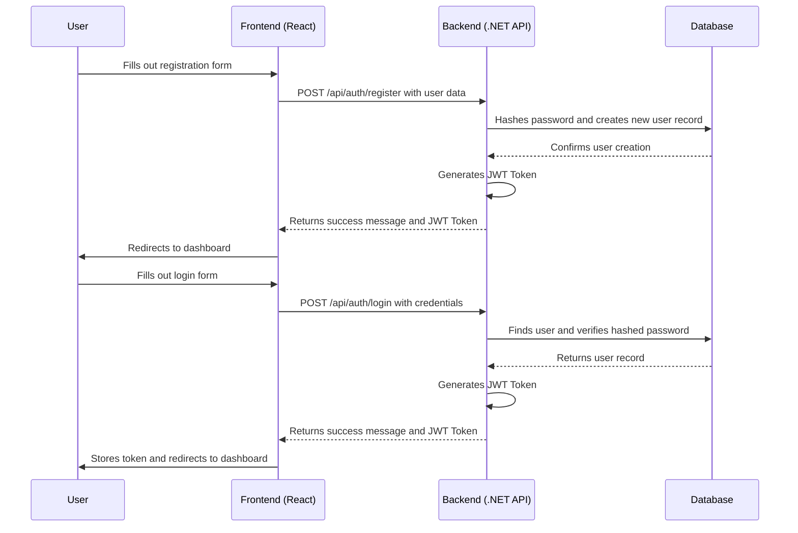

# Epic 1: Authentication & User Management - Detailed User Stories

## Authentication Flow Diagram

## US-001: User Registration
**As a** new user,  
**I want to** create a secure account using my email, name, and a password,  
**So that** I can gain access to the application and protect my personal data.

### Acceptance Criteria:
- [ ] The registration form must include fields for First Name, Last Name, Email, and Password.
- [ ] All fields are required.
- [ ] The system must validate that the email address is in a valid format.
- [ ] The email address must be unique across all users in the system. If the email is already taken, a clear error message should be displayed.
- [ ] The password must be at least 8 characters long and include at least one uppercase letter, one lowercase letter, and one number.
- [ ] A password strength indicator should provide real-time feedback to the user.
- [ ] Upon successful registration, the user should be automatically logged in and redirected to the main dashboard.
- [ ] A success message or toast notification should confirm that the registration was successful.
- [ ] If registration fails due to invalid data, specific, user-friendly error messages should be displayed next to the corresponding fields.

## US-002: User Login
**As a** registered user,  
**I want to** log in securely with my email and password,  
**So that** I can access my personalized dashboard and manage my data.

### Acceptance Criteria:
- [ ] The login form must include fields for Email and Password.
- [ ] The system must validate the user's credentials against the stored user data.
- [ ] If the credentials are valid, the user should be redirected to their dashboard.
- [ ] If the credentials are invalid, a clear and generic error message (e.g., "Invalid email or password") should be displayed.
- [ ] The login process should be protected against brute-force attacks (e.g., by implementing rate limiting).
- [ ] A "Remember Me" checkbox should allow the user to stay logged in for an extended period (e.g., 7 days).
- [ ] The user's session should be securely managed using JWT (JSON Web Tokens).

## US-003: User Logout
**As a** logged-in user,  
**I want to** be able to log out of the application,  
**So that** I can ensure my account is secure when I am finished using it.

### Acceptance Criteria:
- [ ] A clearly visible "Logout" button should be available in the application's main navigation or user profile menu.
- [ ] Clicking the "Logout" button should immediately terminate the user's session.
- [ ] The JWT token should be invalidated or cleared from the client-side storage.
- [ ] After logging out, the user should be redirected to the login page.
- [ ] Any attempt to access protected pages after logging out should redirect the user back to the login page.

## US-004: Password Recovery
**As a** user who has forgotten their password,  
**I want to** be able to reset my password securely,  
**So that** I can regain access to my account.

### Acceptance Criteria:
- [ ] A "Forgot Password?" link should be available on the login page.
- [ ] Clicking the link should take the user to a page where they can enter their registered email address.
- [ ] If the email address exists in the system, a password reset link should be sent to that email.
- [ ] The password reset link should be a unique, single-use token with a limited expiration time (e.g., 1 hour).
- [ ] Clicking the link in the email should take the user to a page where they can enter and confirm a new password.
- [ ] The new password must meet the same security requirements as the registration password.
- [ ] Upon successfully resetting the password, the user should be notified and redirected to the login page.

## US-005: Unit and Integration Testing
**As a** developer,
**I want to** have comprehensive unit and integration tests for the authentication and user management features,
**So that** I can ensure the reliability, security, and correctness of the implementation.

### Acceptance Criteria:
- [ ] Unit tests should cover all methods in the `AuthService`, including successful registration, login, and token generation.
- [ ] Unit tests should handle edge cases, such as invalid input, duplicate users, and incorrect passwords.
- [ ] Integration tests should cover the `AuthController` endpoints, including `/api/auth/register` and `/api/auth/login`.
- [ ] Integration tests should simulate real-world scenarios, such as user registration, login, and accessing protected resources.
- [ ] All tests should be automated and integrated into the CI/CD pipeline.