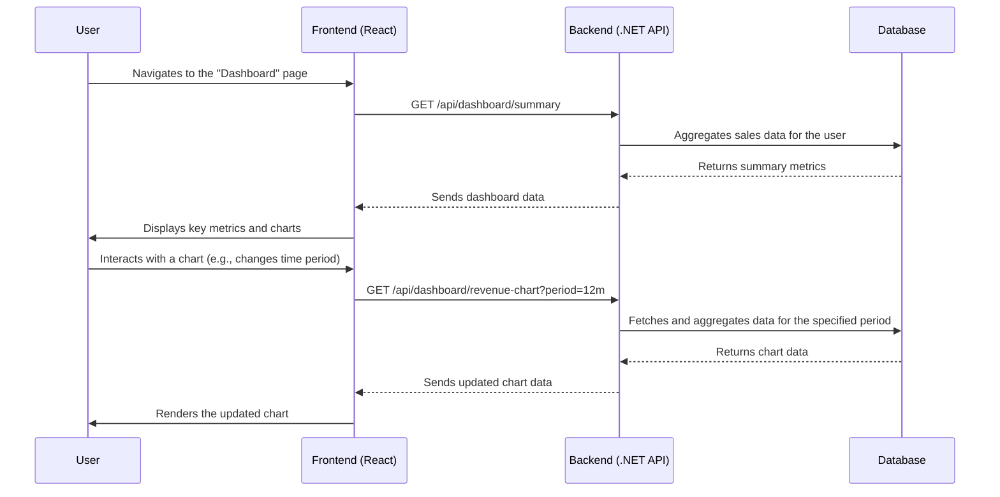

# Epic 4: Dashboard & Analytics (MVP) - Detailed User Stories

## Dashboard Data Flow Diagram

## US-011: View Dashboard Overview
**As an** author,  
**I want to** see a high-level dashboard of my publishing performance,  
**So that** I can quickly understand my business at a glance.

### Acceptance Criteria:
- [ ] The dashboard must be the default page after a user logs in.
- [ ] It must display key performance indicators (KPIs) in a clear, easy-to-read format.
- [ ] KPIs must include: Total Revenue (for various time periods), Total Books Published, and Total Sales Transactions.
- [ ] The dashboard must highlight the top-performing book and top-performing platform by revenue for the current month.
- [ ] All metrics must have appropriate loading states to indicate that data is being fetched.
- [ ] If no data is available, a user-friendly empty state message should be displayed for each metric.

## US-012: View Revenue Chart
**As an** author,  
**I want to** see a visual chart of my revenue over time,  
**So that** I can identify trends and patterns in my sales.

### Acceptance Criteria:
- [ ] The dashboard must include a chart (e.g., line or bar chart) displaying monthly revenue.
- [ ] By default, the chart should show data for the last 6 months.
- [ ] The user must be able to toggle the time period for the chart (e.g., 3 months, 6 months, 1 year).
- [ ] The chart must be interactive, with tooltips that show the exact revenue value when hovering over a data point.
- [ ] The chart should gracefully handle months with no sales, displaying them as zero.
- [ ] The chart must be responsive and render correctly on both desktop and mobile devices.

## US-013: View Platform Performance Summary
**As an** author,  
**I want to** see how my books perform on different platforms,  
**So that** I can focus my efforts on the most profitable platforms.

### Acceptance Criteria:
- [ ] The dashboard must include a section summarizing performance by platform.
- [ ] This summary should show a breakdown of total revenue by platform for the last 6 months.
- [ ] The data should be presented in both a table and a chart (e.g., a pie or donut chart).
- [ ] The table should include the platform name, total revenue, and its percentage of the total revenue.
- [ ] The user must be able to filter the platform performance data by a date range.

## US-014: Unit and Integration Testing
**As a** developer,
**I want to** have comprehensive unit and integration tests for the dashboard and analytics features,
**So that** I can ensure the accuracy and reliability of the data presented to the user.

### Acceptance Criteria:
- [ ] Unit tests should cover any new business logic for data aggregation and calculation in the backend.
- [ ] Integration tests should cover the new dashboard API endpoints (e.g., `/api/dashboard/summary`, `/api/dashboard/revenue-chart`).
- [ ] Tests should simulate different scenarios, such as a user with no sales data, a user with sales on only one platform, etc.
- [ ] The accuracy of the aggregated data (e.g., total revenue, top performers) must be verified.
- [ ] All tests should be automated and integrated into the CI/CD pipeline.