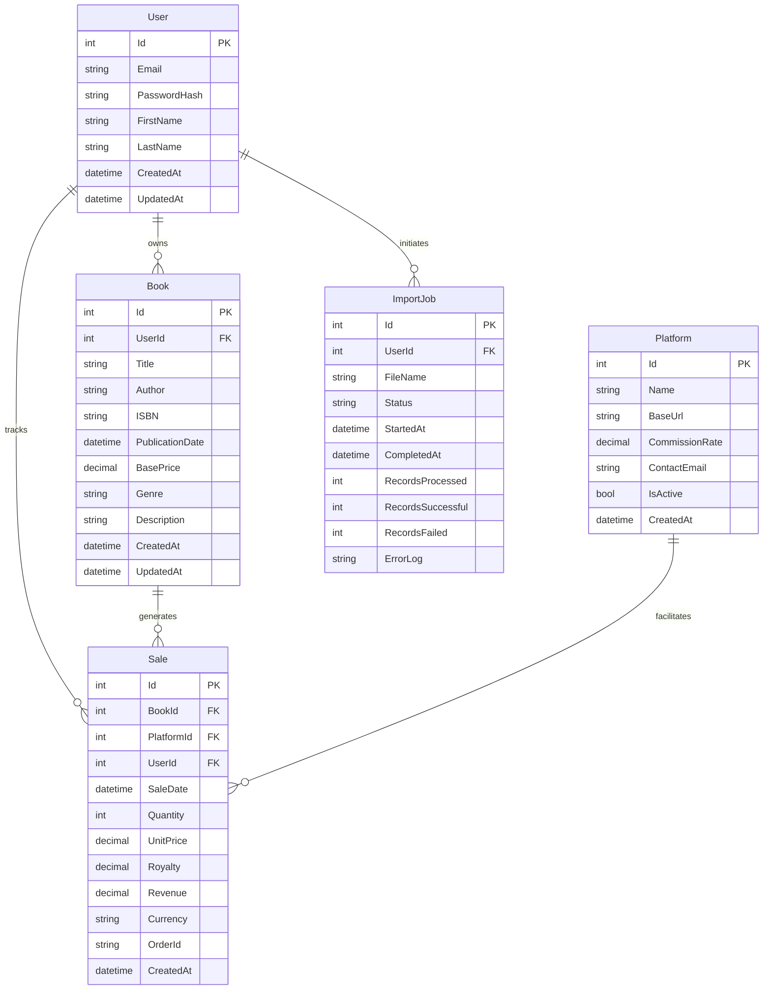

# Database Schema & Sample Data

## Entity Relationship Diagram



## SQL Schema Script

```sql
-- Users table
CREATE TABLE Users (
    Id INT IDENTITY(1,1) PRIMARY KEY,
    Email NVARCHAR(255) NOT NULL UNIQUE,
    PasswordHash NVARCHAR(255) NOT NULL,
    FirstName NVARCHAR(100) NOT NULL,
    LastName NVARCHAR(100) NOT NULL,
    CreatedAt DATETIME2 DEFAULT GETDATE(),
    UpdatedAt DATETIME2 DEFAULT GETDATE()
);

-- Platforms table (pre-populated with common publishing platforms)
CREATE TABLE Platforms (
    Id INT IDENTITY(1,1) PRIMARY KEY,
    Name NVARCHAR(100) NOT NULL,
    BaseUrl NVARCHAR(255),
    CommissionRate DECIMAL(5,4), -- e.g., 0.3000 for 30%
    ContactEmail NVARCHAR(255),
    IsActive BIT DEFAULT 1,
    CreatedAt DATETIME2 DEFAULT GETDATE()
);

-- Books table
CREATE TABLE Books (
    Id INT IDENTITY(1,1) PRIMARY KEY,
    UserId INT NOT NULL FOREIGN KEY REFERENCES Users(Id),
    Title NVARCHAR(255) NOT NULL,
    Author NVARCHAR(255) NOT NULL,
    ISBN NVARCHAR(20),
    PublicationDate DATE,
    BasePrice DECIMAL(10,2),
    Genre NVARCHAR(100),
    Description NVARCHAR(MAX),
    CreatedAt DATETIME2 DEFAULT GETDATE(),
    UpdatedAt DATETIME2 DEFAULT GETDATE()
);

-- Sales table
CREATE TABLE Sales (
    Id INT IDENTITY(1,1) PRIMARY KEY,
    BookId INT NOT NULL FOREIGN KEY REFERENCES Books(Id),
    PlatformId INT NOT NULL FOREIGN KEY REFERENCES Platforms(Id),
    UserId INT NOT NULL FOREIGN KEY REFERENCES Users(Id),
    SaleDate DATE NOT NULL,
    Quantity INT NOT NULL,
    UnitPrice DECIMAL(10,2) NOT NULL,
    Royalty DECIMAL(10,2) NOT NULL,
    Revenue DECIMAL(10,2) NOT NULL,
    Currency NVARCHAR(3) DEFAULT 'USD',
    OrderId NVARCHAR(100),
    CreatedAt DATETIME2 DEFAULT GETDATE()
);

-- Import Jobs table for tracking CSV uploads
CREATE TABLE ImportJobs (
    Id INT IDENTITY(1,1) PRIMARY KEY,
    UserId INT NOT NULL FOREIGN KEY REFERENCES Users(Id),
    FileName NVARCHAR(255) NOT NULL,
    Status NVARCHAR(50) NOT NULL, -- 'Processing', 'Completed', 'Failed'
    StartedAt DATETIME2 DEFAULT GETDATE(),
    CompletedAt DATETIME2,
    RecordsProcessed INT DEFAULT 0,
    RecordsSuccessful INT DEFAULT 0,
    RecordsFailed INT DEFAULT 0,
    ErrorLog NVARCHAR(MAX)
);

-- Indexes for performance
CREATE INDEX IX_Sales_UserId_SaleDate ON Sales(UserId, SaleDate);
CREATE INDEX IX_Sales_BookId ON Sales(BookId);
CREATE INDEX IX_Sales_PlatformId ON Sales(PlatformId);
CREATE INDEX IX_Books_UserId ON Books(UserId);
```

## Sample Data for Development

### Platforms (Pre-populated)
```sql
INSERT INTO Platforms (Name, BaseUrl, CommissionRate, ContactEmail, IsActive) VALUES
('Amazon KDP', 'https://kdp.amazon.com', 0.30, 'kdp-support@amazon.com', 1),
('IngramSpark', 'https://www.ingramspark.com', 0.40, 'support@ingramspark.com', 1),
('Draft2Digital', 'https://www.draft2digital.com', 0.10, 'support@draft2digital.com', 1),
('Apple Books', 'https://authors.apple.com', 0.30, 'author-support@apple.com', 1),
('Barnes & Noble Press', 'https://press.barnesandnoble.com', 0.40, 'nookpress@bn.com', 1),
('Kobo Writing Life', 'https://www.kobo.com/writinglife', 0.30, 'writinglife@kobo.com', 1);
```

### Sample User
```sql
INSERT INTO Users (Email, PasswordHash, FirstName, LastName) VALUES
('demo@daleniidigital.com', 'hashed_password_here', 'Demo', 'Author');
```

### Sample Books
```sql
INSERT INTO Books (UserId, Title, Author, ISBN, PublicationDate, BasePrice, Genre, Description) VALUES
(1, 'The Digital Marketing Handbook', 'Demo Author', '978-0123456789', '2023-01-15', 9.99, 'Business', 'A comprehensive guide to digital marketing strategies'),
(1, 'Mastering Remote Work', 'Demo Author', '978-0987654321', '2023-06-20', 12.99, 'Self-Help', 'Tips and techniques for effective remote work'),
(1, 'AI for Everyone', 'Demo Author', '978-0456789123', '2023-11-10', 15.99, 'Technology', 'Understanding artificial intelligence in everyday life');
```

### Sample Sales Data (Last 6 months)
```sql
-- Generate sample sales for the past 6 months
DECLARE @StartDate DATE = DATEADD(MONTH, -6, GETDATE());
DECLARE @EndDate DATE = GETDATE();

-- Amazon KDP Sales
INSERT INTO Sales (BookId, PlatformId, UserId, SaleDate, Quantity, UnitPrice, Royalty, Revenue, Currency, OrderId) VALUES
(1, 1, 1, DATEADD(DAY, -180, GETDATE()), 25, 9.99, 2.50, 62.44, 'USD', 'AMZ-001'),
(1, 1, 1, DATEADD(DAY, -150, GETDATE()), 18, 9.99, 2.50, 44.96, 'USD', 'AMZ-002'),
(1, 1, 1, DATEADD(DAY, -120, GETDATE()), 32, 9.99, 2.50, 79.92, 'USD', 'AMZ-003'),
(2, 1, 1, DATEADD(DAY, -90, GETDATE()), 15, 12.99, 3.25, 48.71, 'USD', 'AMZ-004'),
(2, 1, 1, DATEADD(DAY, -60, GETDATE()), 22, 12.99, 3.25, 71.45, 'USD', 'AMZ-005'),
(3, 1, 1, DATEADD(DAY, -30, GETDATE()), 8, 15.99, 4.00, 31.98, 'USD', 'AMZ-006');

-- Draft2Digital Sales
INSERT INTO Sales (BookId, PlatformId, UserId, SaleDate, Quantity, UnitPrice, Royalty, Revenue, Currency, OrderId) VALUES
(1, 3, 1, DATEADD(DAY, -160, GETDATE()), 12, 9.99, 7.19, 86.30, 'USD', 'D2D-001'),
(2, 3, 1, DATEADD(DAY, -100, GETDATE()), 8, 12.99, 9.34, 74.75, 'USD', 'D2D-002'),
(3, 3, 1, DATEADD(DAY, -45, GETDATE()), 5, 15.99, 11.51, 57.55, 'USD', 'D2D-003');

-- Apple Books Sales
INSERT INTO Sales (BookId, PlatformId, UserId, SaleDate, Quantity, UnitPrice, Royalty, Revenue, Currency, OrderId) VALUES
(1, 4, 1, DATEADD(DAY, -140, GETDATE()), 6, 9.99, 7.00, 41.97, 'USD', 'APL-001'),
(2, 4, 1, DATEADD(DAY, -80, GETDATE()), 4, 12.99, 9.09, 36.37, 'USD', 'APL-002');
```

## Entity Framework Core Models

### C# Entity Classes
```csharp
public class User
{
    public int Id { get; set; }
    public string Email { get; set; } = string.Empty;
    public string PasswordHash { get; set; } = string.Empty;
    public string FirstName { get; set; } = string.Empty;
    public string LastName { get; set; } = string.Empty;
    public DateTime CreatedAt { get; set; }
    public DateTime UpdatedAt { get; set; }
    
    // Navigation properties
    public List<Book> Books { get; set; } = new();
    public List<Sale> Sales { get; set; } = new();
    public List<ImportJob> ImportJobs { get; set; } = new();
}

public class Book
{
    public int Id { get; set; }
    public int UserId { get; set; }
    public string Title { get; set; } = string.Empty;
    public string Author { get; set; } = string.Empty;
    public string? ISBN { get; set; }
    public DateTime? PublicationDate { get; set; }
    public decimal? BasePrice { get; set; }
    public string? Genre { get; set; }
    public string? Description { get; set; }
    public DateTime CreatedAt { get; set; }
    public DateTime UpdatedAt { get; set; }
    
    // Navigation properties
    public User User { get; set; } = null!;
    public List<Sale> Sales { get; set; } = new();
}

public class Platform
{
    public int Id { get; set; }
    public string Name { get; set; } = string.Empty;
    public string? BaseUrl { get; set; }
    public decimal? CommissionRate { get; set; }
    public string? ContactEmail { get; set; }
    public bool IsActive { get; set; } = true;
    public DateTime CreatedAt { get; set; }
    
    // Navigation properties
    public List<Sale> Sales { get; set; } = new();
}

public class Sale
{
    public int Id { get; set; }
    public int BookId { get; set; }
    public int PlatformId { get; set; }
    public int UserId { get; set; }
    public DateTime SaleDate { get; set; }
    public int Quantity { get; set; }
    public decimal UnitPrice { get; set; }
    public decimal Royalty { get; set; }
    public decimal Revenue { get; set; }
    public string Currency { get; set; } = "USD";
    public string? OrderId { get; set; }
    public DateTime CreatedAt { get; set; }
    
    // Navigation properties
    public Book Book { get; set; } = null!;
    public Platform Platform { get; set; } = null!;
    public User User { get; set; } = null!;
}

public class ImportJob
{
    public int Id { get; set; }
    public int UserId { get; set; }
    public string FileName { get; set; } = string.Empty;
    public string Status { get; set; } = string.Empty; // Processing, Completed, Failed
    public DateTime StartedAt { get; set; }
    public DateTime? CompletedAt { get; set; }
    public int RecordsProcessed { get; set; }
    public int RecordsSuccessful { get; set; }
    public int RecordsFailed { get; set; }
    public string? ErrorLog { get; set; }
    
    // Navigation properties
    public User User { get; set; } = null!;
}
```

## CSV Import Format Examples

### Amazon KDP Sales Report Format
```csv
Order ID,Sale Date,Title,Author,ISBN,Quantity,Unit Price,Royalty,Currency
AMZ-12345,2024-01-15,The Digital Marketing Handbook,Demo Author,978-0123456789,5,9.99,2.50,USD
AMZ-12346,2024-01-16,The Digital Marketing Handbook,Demo Author,978-0123456789,3,9.99,2.50,USD
```

### Draft2Digital Sales Report Format
```csv
Date,Title,Author,ISBN,Store,Units Sold,Net Revenue,Royalty Rate,Author Earnings
2024-01-15,Mastering Remote Work,Demo Author,978-0987654321,Apple,8,103.92,0.72,74.82
2024-01-16,Mastering Remote Work,Demo Author,978-0987654321,Barnes & Noble,2,25.98,0.72,18.71
```

This schema provides a solid foundation for the publishing tracker application with realistic data structures and sample data for development and testing.