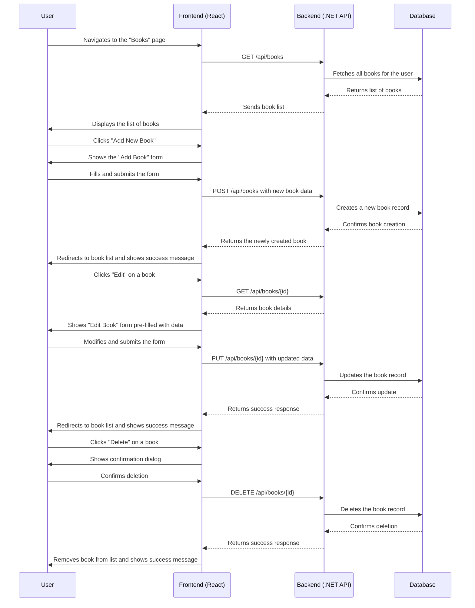

# Epic 2: Book Management - Detailed User Stories

## Book Management Flow Diagram

## US-004: View My Books
**As an** author,  
**I want to** see a list of all my published books,  
**So that** I can quickly access and manage my book portfolio.

### Acceptance Criteria:
- [ ] The "Books" page should display a list of all books associated with the logged-in user.
- [ ] Each book in the list should display its Title, Author, Publication Date, and Genre.
- [ ] By default, the books should be sorted by Publication Date in descending order (newest first).
- [ ] A search bar should allow the user to filter books by Title or Author.
- [ ] If the user has no books, a clear message should be displayed (e.g., "You haven't added any books yet. Click 'Add New Book' to get started.").
- [ ] The list should be paginated if the user has more than 20 books.

## US-005: Add New Book
**As an** author,  
**I want to** add a new book to my portfolio,  
**So that** I can start tracking its sales performance.

### Acceptance Criteria:
- [ ] An "Add New Book" button should be clearly visible on the books list page.
- [ ] The "Add Book" form must include fields for: Title (required), Author (required), ISBN, Publication Date, Base Price, and Genre.
- [ ] The form must validate that "Title" and "Author" fields are not empty before submission.
- [ ] Upon successful submission, the new book should be added to the user's portfolio.
- [ ] The user should be redirected back to the updated books list page after a successful addition.
- [ ] A success message or toast notification should confirm the book was added.
- [ ] If the form submission fails due to invalid data, specific error messages should be displayed for the relevant fields.

## US-006: Edit Book Details
**As an** author,  
**I want to** edit my book information,  
**So that** I can keep my book details accurate and up-to-date.

### Acceptance Criteria:
- [ ] An "Edit" button or icon should be available for each book in the list.
- [ ] Clicking "Edit" should navigate the user to an "Edit Book" form, pre-populated with the selected book's current data.
- [ ] The user should be able to modify all fields, including Title, Author, ISBN, Publication Date, Base Price, and Genre.
- [ ] Upon submitting the form, the changes should be saved to the database.
- [ ] The user should be redirected back to the books list page, where the updated information is visible.
- [ ] A success message should confirm that the book details were updated.
- [ ] A "Cancel" button should allow the user to return to the book list without saving any changes.

## US-007: Delete Book
**As an** author,  
**I want to** remove a book from my portfolio,  
**So that** I can clean up books that are no longer relevant.

### Acceptance Criteria:
- [ ] A "Delete" button or icon should be available for each book in the list.
- [ ] Clicking "Delete" must trigger a confirmation dialog to prevent accidental deletion (e.g., "Are you sure you want to delete this book? This action cannot be undone.").
- [ ] If the user confirms, the book and all its associated sales data should be permanently removed from the system.
- [ ] After successful deletion, the user should be returned to the books list, and the deleted book should no longer be visible.
- [ ] A success message should confirm that the book was deleted.

## US-008: Unit and Integration Testing
**As a** developer,
**I want to** have comprehensive unit and integration tests for the book management features,
**So that** I can ensure the reliability, data integrity, and correctness of the implementation.

### Acceptance Criteria:
- [ ] Unit tests should cover all methods in the `BookService` (or equivalent), including creating, retrieving, updating, and deleting books.
- [ ] Unit tests should handle edge cases, such as invalid input data, non-existent book IDs, and authorization failures.
- [ ] Integration tests should cover the `BooksController` endpoints: `GET /api/books`, `POST /api/books`, `PUT /api/books/{id}`, and `DELETE /api/books/{id}`.
- [ ] Integration tests should simulate real-world user scenarios, such as adding a book, editing its details, and then deleting it.
- [ ] All tests should be automated and integrated into the CI/CD pipeline to run automatically on each new build.