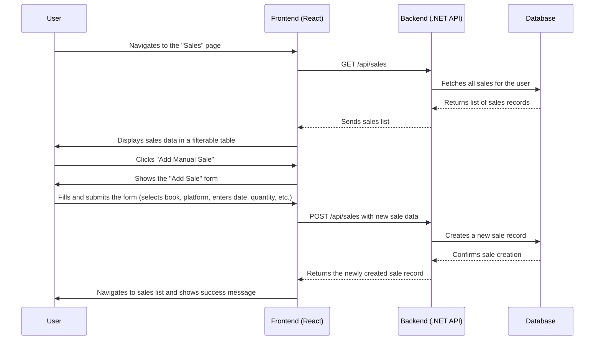

# Epic 3: Sales Data Management - Detailed User Stories

## Sales Data Flow Diagram

## US-008: View Sales Overview
**As an** author,  
**I want to** see a summary of my recent sales activity,  
**So that** I can quickly understand my current performance.

### Acceptance Criteria:
- [ ] The "Sales" page should display a high-level summary of sales metrics.
- [ ] The summary must include: Total Revenue, Total Units Sold, and Average Royalty per Sale.
- [ ] These metrics should be available for different time periods (e.g., Current Month, Previous Month, Last 6 Months).
- [ ] The UI should clearly label each metric and time period.
- [ ] A loading indicator must be displayed while the sales data is being fetched.
- [ ] If no sales data exists, a user-friendly message should be shown (e.g., "No sales data available for this period.").

## US-009: View Detailed Sales List
**As an** author,  
**I want to** see a detailed list of all my sales transactions,  
**So that** I can analyze individual sales and identify patterns.

### Acceptance Criteria:
- [ ] A data table should display a list of all sales transactions.
- [ ] The table columns must include: Sale Date, Book Title, Platform, Quantity, Unit Price, Royalty, and Revenue.
- [ ] By default, the sales should be sorted by Sale Date in descending order (most recent first).
- [ ] The user must be able to sort the data by any column.
- [ ] The user must be able to filter the sales data by a date range, by book, and by platform.
- [ ] The table should be paginated, showing a reasonable number of sales per page (e.g., 25).

## US-010: Add Manual Sale Entry
**As an** author,  
**I want to** manually add individual sales records,  
**So that** I can track sales from platforms that don't provide CSV exports.

### Acceptance Criteria:
- [ ] An "Add Sale" button should be available on the sales list page.
- [ ] The "Add Sale" form must include fields for: Book (dropdown of user's books), Platform (dropdown), Sale Date, Quantity, Unit Price, and Royalty.
- [ ] The system should automatically calculate the total revenue (Quantity × Royalty) when the form is submitted.
- [ ] All required fields (Book, Platform, Sale Date, Quantity, Royalty) must be validated before submission.
- [ ] Upon successful submission, the new sale record should be added to the database.
- [ ] The user should be redirected to the updated sales list page and see a success confirmation.

## US-011: Unit and Integration Testing
**As a** developer,
**I want to** have comprehensive unit and integration tests for the sales data management features,
**So that** I can ensure the reliability and correctness of the sales data processing.

### Acceptance Criteria:
- [ ] Unit tests should cover any new business logic in the `SalesService` (or equivalent).
- [ ] Integration tests should cover the `Sales` API endpoints: `GET /api/sales` and `POST /api/sales`.
- [ ] Tests should simulate creating a new sale and then fetching the list to verify that the new sale is included.
- [ ] Edge cases, such as invalid data and unauthorized access, must be tested.
- [ ] All tests should be automated and integrated into the CI/CD pipeline.