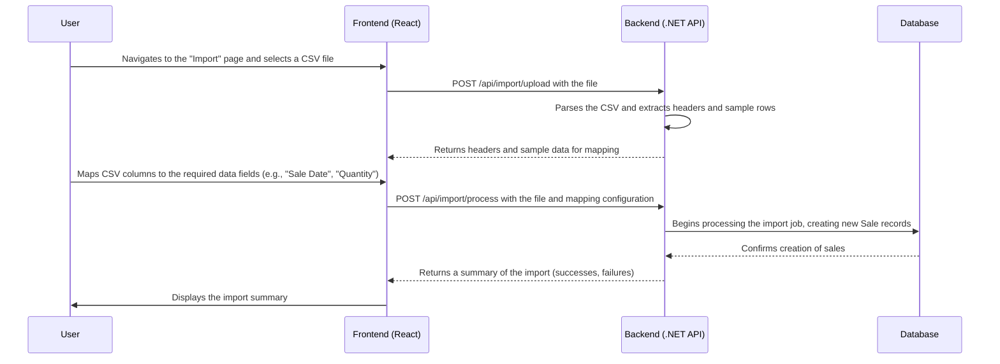

# Epic 5: CSV Import (Basic) - Detailed User Stories

## CSV Import Flow Diagram

## US-014: Upload CSV File
**As an** author,  
**I want to** upload a CSV file containing my sales data,  
**So that** I can quickly import large amounts of sales data from platform reports.

### Acceptance Criteria:
- [ ] An "Import Sales" page must be available in the application.
- [ ] The user must be able to select a CSV file from their local machine.
- [ ] The system must validate the file type, accepting only `.csv` and `.txt` files.
- [ ] A file size limit (e.g., 5MB) must be enforced to prevent performance issues.
- [ ] An upload progress indicator should be displayed during the file transfer.
- [ ] Upon successful upload, the user should be taken to the column mapping step.
- [ ] Clear error messages must be displayed for invalid file types or sizes.

## US-015: Map CSV Columns
**As an** author,  
**I want to** map the columns from my CSV file to the correct data fields in the application,  
**So that** the system can correctly import my sales data regardless of the CSV format.

### Acceptance Criteria:
- [ ] After uploading a file, the user must be presented with a column mapping interface.
- [ ] This interface must display the headers from the CSV file and a preview of the first few rows.
- [ ] For each required data field (e.g., Book Title, Platform, Sale Date, Quantity, Royalty), the user must be able to select the corresponding column from their CSV.
- [ ] The system should attempt to automatically map columns based on common header names (e.g., "Date" -> "Sale Date").
- [ ] The user must be able to save the mapping configuration for a specific platform to reuse it for future imports.
- [ ] The interface must validate that all required fields have been mapped before proceeding.

## US-016: Process CSV Import
**As an** author,  
**I want to** process my mapped CSV data and import it into the system,  
**So that** I can see my sales data in the dashboard and reports.

### Acceptance Criteria:
- [ ] After confirming the column mapping, the system must begin processing the CSV file.
- [ ] A progress indicator should show the status of the import.
- [ ] The system must automatically match book titles from the CSV to existing books in the user's portfolio.
- [ ] If a book title in the CSV does not exist, a new book should be automatically created.
- [ ] Upon completion, a summary of the import must be displayed, including the number of successful and failed records.
- [ ] For any failed records, clear error messages should be provided to help the user diagnose the issue.

## US-017: View Import History
**As an** author,  
**I want to** see a history of my CSV imports,  
**So that** I can track what data has been imported and troubleshoot any issues.

### Acceptance Criteria:
- [ ] A dedicated "Import History" page must be available.
- [ ] This page should list all previous import jobs, showing the filename, date, and status (e.g., "Completed", "Failed").
- [ ] Each import job in the list should display statistics, including the number of records processed, successful, and failed.
- [ ] The user must be able to view a detailed error log for any failed imports.

## US-018: Unit and Integration Testing
**As a** developer,
**I want to** have comprehensive unit and integration tests for the CSV import feature,
**So that** I can ensure the reliability and accuracy of the data import process.

### Acceptance Criteria:
- [ ] Unit tests should cover the CSV parsing and data mapping logic.
- [ ] Integration tests should cover the API endpoints for file upload and processing.
- [ ] Tests should simulate various scenarios, including valid CSVs, malformed CSVs, and files with missing data.
- [ ] The tests must verify that sales records are created correctly and that new books are created when necessary.
- [ ] All tests should be automated and integrated into the CI/CD pipeline.